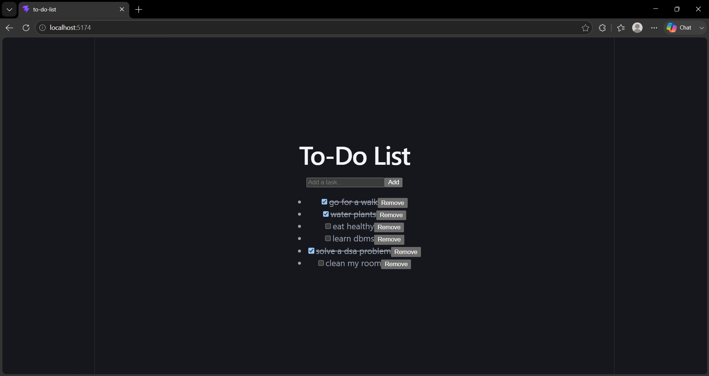

# 📝 To-Do List (React)

A simple and efficient **To-Do List application** built with React.  
This project demonstrates core React concepts such as **state management, event handling, conditional rendering, and local storage persistence**.

---

## 🚀 Features
- ➕ Add new tasks
- ✅ Mark tasks as complete (checkbox toggle)
- ❌ Delete tasks
- 📦 Persist tasks using **localStorage** (tasks remain after refresh)
- 🎨 Clean and minimal UI (easy to extend with Tailwind or CSS)

---

## 🛠 Tech Stack
- **React** (Functional Components + Hooks)
- **JavaScript (ES6+)**
- **CSS** for styling
- **LocalStorage** for persistence

---

## 📂 Project Structure
Todolist/
├── src/
│   ├── App.jsx      # Main React component
│   ├── index.css    # Styles
│   └── main.jsx     # Entry point
├── package.json
└── README.md

---

## ⚡ Getting Started

### 1. Clone the repository
```bash
git clone https://github.com/varshithathogaru/to-do-list-react-.git
cd to-do-list-react-
2. Install dependencies
bash
npm install
3. Run the app
bash
npm run dev

## 📸 Screenshot


